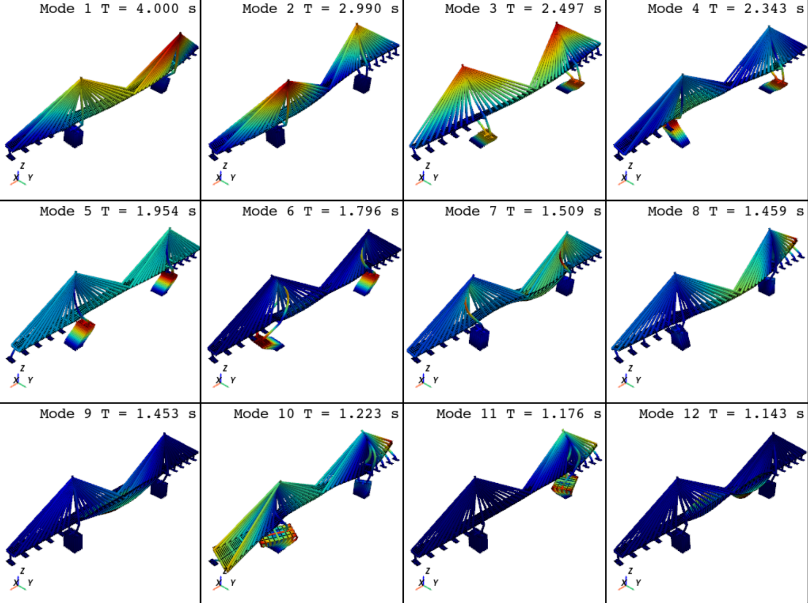

OpenSeesPy Model Visualization
===================================

Currently, Module :mod:`opstool.vis` provides two major roles, OpenSeesPy model (including responses) visualization and 
fiber section (including responses) visualization. 
Before visualization, class :class:`~opstool.vis.GetFEMdata` is needed to get data from the current domain of OpenSeesPy. 
The class :class:`~opstool.vis.GetFEMdata` automatically generates the result files in the specified output directory, 
which will be read by the visualization class :class:`~opstool.vis.OpsVisPlotly`, :class:`~opstool.vis.OpsVisPyvista`,
and :class:`~opstool.vis.FiberSecVis`.

.. tip:: 
   The module :mod:`opstool.vis` provides two plotting backends to visualize the OpenSeesPy model, including ``plotly`` and ``pyvista``.
   The visualization classes are :class:`~opstool.vis.OpsVisPlotly` and :class:`~opstool.vis.OpsVisPyvista` respectively. 
   ``Plotly`` renders images based on the web, and ``pyvista`` is a python wrapper for the C++ visualization package ``VTK``. 
   In general, ``plotly`` renders a bit slower than ``pyvista``, but provides powerful interactivity. 
   The choice depends on your preference, but both have almost the same interface.

Here are some guidelines on model visualization and fiber section visualization.

.. toctree::
   :maxdepth: 2
   :caption: Contents:

   notebooks/mod_vis_plotly.ipynb
   notebooks/mod_vis_pyvista.ipynb
   notebooks/mod_vis_fibersec.ipynb

Quick Model and Eigenmodes Visualization
=========================================

In addition, ``opstool`` provides functions :py:func:`~opstool.vis.plot_model` and :py:func:`~opstool.vis.plot_eigen` to quickly plot model and eigenmodes,
which can reduce your code work.

Example
++++++++

.. code-block:: python

    import openseespy.opensees as ops
    import opstool as opst

    # opst.load_ops_examples("ArchBridge")
    opst.load_ops_examples("CableStayedBridge")
    # opst.load_ops_examples("Dam")
    # opst.load_ops_examples("Frame3D")
    # load_ops_examples("Igloo")
    # load_ops_examples("Pier")
    # opst.load_ops_examples("SuspensionBridge")

    # ------------------------
    # or your model code here
    # ------------------------
    
    opst.plot_model(backend="pyvista")    # or backend="plotly"

.. image:: api/images/plot_model.png
   :align: center

.. code-block:: python

    opst.plot_eigen(mode_tags=[1, 12], backend="pyvista", subplots=True)   # or backend="plotly"

