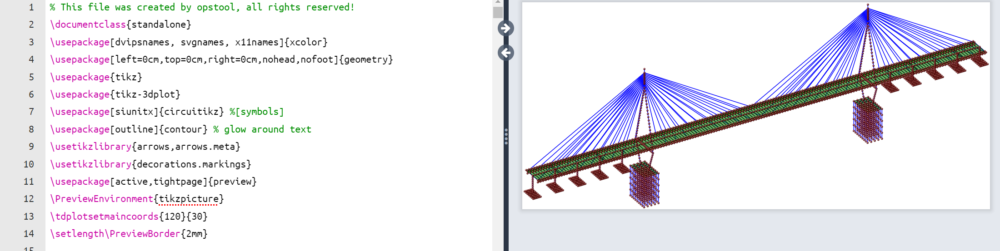

Output model data as ``tikz`` code in ``latex``
-------------------------------------------------

.. autofunction:: opstool.vis.save_tikz

Example
++++++++

.. code:: python

    import openseespy.opensees as ops
    import opstool as opst

    # opst.load_ops_examples("ArchBridge")
    opst.load_ops_examples("CableStayedBridge")
    # opst.load_ops_examples("Dam")
    # opst.load_ops_examples("Frame3D")
    # opst.load_ops_examples("Igloo")
    # opst.load_ops_examples("Pier")
    # opst.load_ops_examples("SuspensionBridge")

    # ------------------------
    # or your model code here
    # ------------------------

    ModelData = opst.GetFEMdata(results_dir="opstool_output")
    ModelData.get_model_data(save_file="ModelData.hdf5")

    opst.save_tikz("opstool_output/ModelData.hdf5", "ModelData.tex")

You can open and compile the generated file ``ModelData.tex`` in `overleaf <https://www.overleaf.com/>`_

