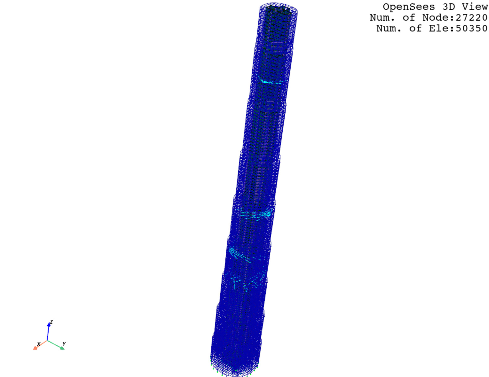

606 m Mega-tall Building
--------------------------

See the original ``tcl`` file of the model in `OpenSees models for a 606 m Mega-tall Building <http://www.luxinzheng.net/download/OpenSEES/Mega-tall_Building_Benchmark_OpenSees.htm>`_,
and a ``py`` file converted by :func:`opstool.preprocessing.tcl2py` that you can download from here 
https://ln5.sync.com/dl/9e3582d40/2s3k7ayf-e52anp3t-mjfa89vz-jc427xsb named ``MegatallBuilding.py``.

.. code-block:: python

    import opstool as opst
    from MegatallBuilding import *
    opst.plot_model(backend="pyvista", point_size=0.1, line_width=0.5)

